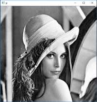
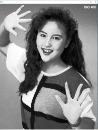

------------------
  数字图像处理报告
  ==================

  --
  --

## 摘要：

本文将利用VS平台和c++ 以及Opencv开源库基于图像的直方图对图像进行一系列操作，如直方图的绘制，直方图均衡，进行直方图匹配，进行图像增强；对图像进行7\*7的局部直方图增强；利用直方图对图像进行分割等。

## **题目一：直方图绘制**

### 一．图像直方图简介

灰度级范围为\[0,L-1\]的数字图像的直方图是离散函数h（rk）=nk，其中rk是第k级灰度值，nk是图像中灰度为rk的像素个数。在实践中，经常用乘积MN表示的图像总像素除每个分量来归一化直方图，通常M和N是图像的行数和列数。因此，归一化后的直方图由p(rk)=nk/MN给出。其中k=0，1，\...，L-1。简单地说，p(rk)是灰度级rk在图像中出现的概率的估计。归一化直方图的所有分量之和应等于1。\[1\]

图像的灰度直方图具有以下性质\[2\]：

1.  灰度直方图只能反映图像的灰度分布情况，而不能反映图像像素的位置，即丢失了像素的位置信息。

2.  一幅图像对应唯一的直方图，反之不成立，不同的图像可对应相同的直方图。

3.  灰度直方图反映了图像中每一灰度级与其出现频率之间的关系，它描述该图像的概貌。

### 二．各个图像的直方图

以下为图像（左）及其直方图（右）：

     

   


 

 

 

 

 

 

 

 

 

 

 

	

 

 

 

 

 

### 三.**讨论**

可见不同的图像直方图一般是

不同的，在拥有一个大块同一灰度的图像中会出现峰值，暗色图片的直方图偏向左边，亮色图片的直方图偏向右边。低对比度的图像具有窄的直方图，而高对比度的图像具有较为广泛的直方图。

## **题目二：直方图均衡**

### 一.**直方图均衡算法**

直方图均衡化(Histogram Equalization) 又称直方图平坦化,实质上是对图像进行非线性拉伸,重新分配图像象元值,使一定灰度范围内象元值的数量大致相等。这样,原来直方图中间的峰顶部分对比度得到增强,而两侧的谷底部分对比度降低,输出图像的直方图是一个较平的分段直方图:如果输出数据分段值较小的话,会产生粗略分类的视觉效果

如图所示就是直方图均衡化, 即将随机分布的图像直方图修改成均匀分布的直方图。基本思想是对原始图像的像素灰度做某种映射变换, 使变换后图像灰度的概率密度呈均匀分布。这就意味着图像灰度的动态范围得到了增加, 提高了图像的对比度。


### 二.**运行结果：**

如图，左为原图，右图为直方图均衡后的图。

 

   


 

 

 

 

 

 

 

	

 

 

 

 


### 三.**总结分析：**

我们可以看到对对比度适中的图像，直方图均衡的效果一般，同时会降低图像细节程度，对对比度小的图像，直方图均衡的效果显著，可以突出图像细节。

而对于对比图很高的图像，直方图均衡基本没有什么改变。

## **题目三：直方图匹配**

### 一.**直方图匹配算法\[2\]**

1\. 根据以下公式（直方图均衡时用到的公式）计算输入图像的s = T(r)


2\. 根据相同的公式计算模板直方图的 G(z)，p(z)为模板直方图的pdf。     


3\. 令G(z) = T(r)，求出r→z，当不止一个z满足时，通常选择最小的值。

注意：a. 对于灰度级为L，取值为\[0, L-1\]的灰度直方图，在计算T(r)和G(z)的过程中要四舍五入。 b. 由于对G(z)和T(r)进行了四舍五入，因此求r对应的z时，有可能有多个z满足要求，一般选择z最小的值。

r→z的求解：r→z表示对于一个r(对于L = 256的灰度直方图，r取0,1,2,\...,254,255)，找出满足T(r) = G(z)的z，若不存在，则找出最接近的z（即找出min(abs( T(r) - G(z) ) 对应的z）。前面已经说了，当z有多个时，通常取最小的。（若不考虑只取整数的情况，则当p(r)和p(z)处处不为0时，仅有一个z与r对应）

### 二.**运行结果：**

#### 1)Lena图作为模板的配准

   


 

 

#### 2)woman图作为模板的配准

 

 

#### 2)citywall图作为模板的配准

 

 

 

	

#### 3）elain图作为模板的配准

 

 

 

### 三.**结果分析**

我们可以看出，直方图匹配并不能完全使图像和模板图像完全一致，因为数字图像本身相对于模拟图像就失去了一些信息，同时我们也可以看出，二值图像匹配结果相差得最多，因为其失去的信息太多，只能保持色调上一致。同时和直方图均衡比，直方图匹配更加灵活，可以实现指定模板的图像增强。

## **题目四：7\*7局部直方图增强**

### 一.**局部直方图原理**

局部直方图均衡算法，又称为子块直方图均衡算法按照所均衡子块的重叠程度来分类，可分为子块不重叠、子块重叠与子块部分重叠三种，下面分别对它们作一简介：

#### 1.子块不重叠的均衡算法：

该算法将输入图像划分为一系列不重叠的子块，并对每一个子块进行独立的直方图均衡其优点是图像局部细节对比度能得到充分的增强，缺点是各子块的直方图均衡函数差异较大，输出图像中难以避免块效应。

#### 2.子块重叠的均衡算法：

该算法在输入图像上定义一个矩形子块，利用该子块图像的直方图信息对子块中心的像素进行均衡将子块中心逐像素移动并重复以上处理过程，直至遍历输入图像的所有像素（方法类比于Niblack二值化的过程）。该方法不仅使图像局部细节得到充分的对比度增强，同时消除了块效应由于子块均衡总次数等于输入图像的像素总数，算法效率较低。

#### 3.子块部分重叠的均衡算法

该方法（POSHE）与子块重叠方法的不同之处在于：

（1）子块不是逐像素移动，而是将移动步长约取为子块尺寸的几分之一。

（2）子块均衡的灰度转换函数不仅用于映射子块中心像素灰度值，而且用于映射子块所有像素的灰度值。

（3）对多次被均衡的像素，将均衡结果取平均作为该像素在输出图像中的灰度值

子块部分重叠算法的特点是：

（1）由于子块部分重叠方式减少了相邻子块间的均衡函数形状差异，使块效应基本得以消除对于子块边界可能出现的少量块效应，用块效应消除滤波器（BERF）不难克服。

（2）由于子块均衡总次数比子块重叠方式少得多，计算效率大幅度提高。

（3）图像细节的增强能力与子块重叠算法相近。

### 二.**处理结果：**

这里选用的是子块重叠方法：

 

### 三.**结果分析**

如图所示，经过局部直方图均衡之后，图像细节部分被凸显了出来，但是其他部分呈现出雪花状。背景信息模糊。

## **题目五：基于直方图的图像分割**

### 一.**图像分割简介**

图像分割就是把图像分成若干个特定的、具有独特性质的区域并提出感兴趣目标的技术和过程。它是由图像处理到图像分析的关键步骤。现有的图像分割方法主要分以下几类：基于阈值的分割方法、基于区域的分割方法、基于边缘的分割方法以及基于特定理论的分割方法等。从数学角度来看，图像分割是将数字图像划分成互不相交的区域的过程。图像分割的过程也是一个标记过程，即把属于同一区域的像索赋予相同的编号。

### 二.**P-Tile法简介**

p-tile算法是一种基于灰度直方图统计的的自动阈值选择算法，该算法需要基于一定的先验条件---背景与目标所占的面积比P%。该算法选择阈值的原则是，依次累积灰度直方图，直到该累积值大于或等于前景图像（目标）所占面积，此时的灰度级即为所求的阈值。因为我们要进行分割的是两张人物图像，目标和背景很明确，因此选用次方法。

### 三.**处理结果**

[]() 

## 附录：

### 参考文献：

1.数字图像处理 冈萨雷斯

2.图像分割   百度百科

### 代码：

```
#include "stdafx.h"
#include<opencv2/opencv.hpp>
#include<opencv2/highgui/highgui.hpp>
#include<math.h>
#include<string>
#include<iostream>
#include<vector>
#include "opencv2/stitching.hpp"
#include<time.h>
using namespace cv;
using namespace std;
//绘制直方图。
                                                                                     
int histSize = 255;
float range[] = { 0, 256};
const float *ranges = { range };
int main()
{
	Mat src = imread("C:\\Users\\Lenovo\\Desktop\\elain3.bmp");
	Mat gray;
	cvtColor(src,gray, CV_BGR2GRAY);
	Mat Hist;  
	calcHist(&gray, 1, 0, Mat(), Hist, 1, &histSize, &ranges, true, false);
	Mat drawHist = Mat::zeros(Size(256, 256), CV_8UC3);
	double g_dHistMaxValue;
	minMaxLoc(Hist, 0, &g_dHistMaxValue, 0, 0);
	for (int i = 0; i < 255; i++)
	{
		int value = cvRound(256 * 0.9 *(Hist.at<float>(i) / g_dHistMaxValue));
		line(drawHist, Point(i, drawHist.rows - 1), Point(i, drawHist.rows - 1 - value), Scalar(0, 0, 255));
	}

	imshow("p", drawHist);
	cvWaitKey();
	system("pause");
}
//直方图均衡。

int main()
{
	Mat src = imread("C:\\Users\\Lenovo\\Desktop\\elain3.bmp");
	Mat gray;
	cvtColor(src, gray, CV_BGR2GRAY);
	Mat dst;
	equalizeHist(gray, dst);
	cvNamedWindow("p", 0);
	imshow("p", dst);
	cvWaitKey();
	system("pause");
}
//直方图匹配
int main()
{
	Mat Histget(Mat p);
	Mat src = imread("C:\\Users\\Lenovo\\Desktop\\elain3.bmp");
	Mat orgin = imread("C:\\Users\\Lenovo\\Desktop\\elain.bmp");
	Mat gray,gray1;
	cvtColor(src, gray, CV_BGR2GRAY);
	cvtColor(orgin, gray1, CV_BGR2GRAY);
	Mat s_Hist = Histget(gray);
	Mat o_Hist = Histget(gray1);
	float src_cdf[256] = { 0 };
	float org_cdf[256] = { 0 };
	for (int i = 0; i < 255; i++) {
		if (i == 0) {
			src_cdf[i] = s_Hist.at<float>(i);
			org_cdf[i] = o_Hist.at<float>(i);
		}
		else {
			src_cdf[i] = src_cdf[i - 1] + s_Hist.at<float>(i);
			org_cdf[i] = org_cdf[i - 1] + o_Hist.at<float>(i);
		}
	}
	Mat Lut(1, 256, CV_8U);
	for (int i = 0; i < 256; i++)
	{
		float min = fabs(src_cdf[i] - org_cdf[0]);
		int index = 0;
		for (int j = 0; j < 255; j++)
		{
			if (min > fabs(src_cdf[i] - org_cdf[j]))
			{
				min = src_cdf[i] - org_cdf[j];
				index = j;
			}
		}
		Lut.at<uchar>(i) = static_cast<uchar>(index);
	}
	Mat dst;
	LUT(src, Lut, dst);
	cvNamedWindow("p", 0);
	imshow("p", dst);
	cvWaitKey();
	system("pause");
}
Mat Histget(Mat p)
{
	int histSize = 255;
	float range[] = { 0, 256 };
	const float *ranges = { range };
	Mat Hist;
	calcHist(&p, 1, 0, Mat(), Hist, 1, &histSize, &ranges, true, false);
	return Hist;
}
//分割

float calCurrentEn(Mat Hist, int in)
{
	float Backgroud = 0;
	float Selectgroud = 0;
	float BackgroudEn = 0;
	float SelectgroudEn = 0;
	for (int i = 0; i < 256; i++)
	{
		if (i < in)
		{
			Backgroud += Hist.at<float>(i);
		}
		else
		{
			Selectgroud += Hist.at<float>(i);
		}
	}
	for (int i = 0; i < 256; i++)
	{
		if (i < in&& Hist.at<float>(i) != 0)
		{
			float temp = Hist.at<float>(i) / Backgroud;
			BackgroudEn += (-temp)*logf(temp);
		}
		if (i > in&& Hist.at<float>(i) != 0)
		{
			float temp = Hist.at<float>(i) / Selectgroud;
			SelectgroudEn += (-temp)*logf(temp);
		}
	}

	return BackgroudEn + SelectgroudEn;
}


MatND Histget(Mat p)
{
	int histSize = 256;
	float range[] = { 0, 256 };
	const float *ranges = { range };
	MatND Hist;
	calcHist(&p, 1, 0, Mat(), Hist, 1, &histSize, &ranges, true, false);
	return Hist;
}


int main()
{
	MatND Histget(Mat p);
	Mat src = imread("C:\\Users\\Lenovo\\Desktop\\woman.bmp");
	Mat gray;	
	Mat result;
	cvtColor(src, gray, CV_BGR2GRAY);
	MatND Hist = Histget(gray);
	float maxen = 0;
	int index = 0;
	for (int i = 0; i < 256; i++) {
		float cur_en = calCurrentEn(Hist, i);
		if (cur_en > maxen) {
			maxen = cur_en;
			index = i;
		}
	}
	threshold(gray, result, index, 255,CV_THRESH_BINARY);
	cvNamedWindow("ou", 0);
	imshow("ou", result);
	cvWaitKey();
	return 0;


}

//局部直方图

int main()
{
	Mat src = imread("C:\\Users\\Lenovo\\Desktop\\elain.bmp");
	Mat gray;
	Mat result;
	Mat dst;
	cvtColor(src, gray, CV_BGR2GRAY);
	copyMakeBorder(gray, result, 7, 7, 7, 7, BORDER_REFLECT101);
	for (int i=7; i < gray.rows; i=i+7)
	{
		for (int j=7; j < gray.cols; j=j+7)
		{
			Rect rect(j, i, 7, 7);
			Mat image_roi = result(rect);
			equalizeHist(image_roi, dst);
			for (int row = 0; row < 7; row++)
			{
				for (int col = 0; col < 7; col++)
				{
					result.at<uchar>(i+row , j+col) = dst.at<uchar>(row,col);
				}
			}

		}
	}
	imshow("piu", result);
	cvWaitKey();


}
```

